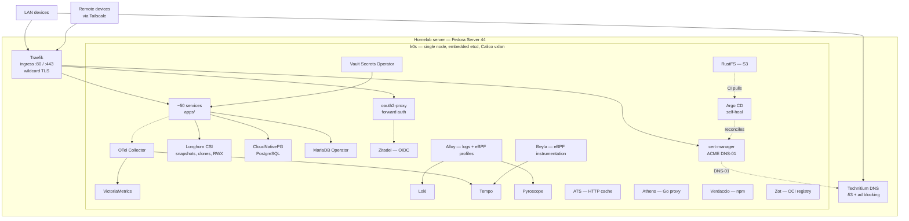

# Homelab

A production-shaped home server: **around fifty services on a single-node Kubernetes cluster**,
managed as code and operated as a learning project for DevOps and SRE practice.

Everything here is real infrastructure, not a demo cluster. It serves the daily needs of one
household while being engineered to the standards you would apply at work: digest-pinned
images, network policies on the namespaces that run workloads, secrets that never touch Git,
air-gapped CI, blameless postmortems, and ADRs explaining why each decision went the way it
did.

> Russian version: [`README.ru.md`](README.ru.md)

## Status

[](docs/status/README.md)
[](docs/status/README.md)
[](docs/status/README.md)
[](docs/status/README.md)
[](docs/adr/)
[](docs/incidents/)

These are not uptime badges. Each number is counted from the repository itself by
[`scripts/status-badges.sh`](scripts/status-badges.sh), and CI fails when the committed
values drift from the code, so any of them can be recomputed and argued with: what is
counted, and what is deliberately excluded, is written down in
[`docs/status/`](docs/status/README.md). Availability, SLO and MTTR are not here yet — they
need history that lives in Gatus rather than in Git.

## What this demonstrates

Rather than a list of tools, a set of practices I can defend and explain:

| Area | What is here |
|---|---|
| **Kubernetes** | Single-node k0s (embedded etcd, Calico vxlan), Longhorn CSI, CloudNativePG, MariaDB Operator, Traefik ingress, a few dozen NetworkPolicies |
| **GitOps** | Argo CD with self-heal, repo-vs-cluster reconciliation, prune rules decided per component |
| **Supply chain** | Virtually every image pinned by `@sha256` digest, gitleaks on every push and PR, air-gapped runners with a checksum-verified toolchain |
| **Secrets** | HashiCorp Vault and Vault Secrets Operator as the primary path, a few dozen `VaultStaticSecret` objects, SOPS and SealedSecrets as legacy |
| **Observability** | All four signals: metrics, logs, traces, profiles, with cross-signal correlation wired end to end |
| **IaC** | Terraform, one root module per external resource, and Ansible with a `production` lint profile |
| **Testing** | A set of CI gates, a golden-file test suite for manifest formatting, Go unit tests |
| **Incident response** | Several blameless postmortems with timelines, impact assessment, and tracked follow-ups |

## Architecture



Architecture model source: [`apps/structurizr/homelab.dsl`](apps/structurizr/homelab.dsl) — a
Structurizr DSL workspace, rendered by the deployed Structurizr instance.

## Platform

| Component | Role | Directory |
|---|---|---|
| k0s | Single-node Kubernetes: Calico CNI, embedded etcd, CoreDNS | [`platform/k0s/`](platform/k0s/) |
| Gateway + Traefik | Gateway API on :80/:443 via `externalIPs`, wildcard TLS | [`platform/traefik/`](platform/traefik/) |
| Technitium DNS | Local DNS, wildcard zone, ad blocking | [`apps/technitium/`](apps/technitium/) |
| cert-manager | TLS via ACME DNS-01 | [`platform/cert-manager/`](platform/cert-manager/) |
| Longhorn | CSI storage: snapshots, clones, RWX | [`platform/longhorn/`](platform/longhorn/) |
| CloudNativePG | PostgreSQL clusters | [`platform/cnpg/`](platform/cnpg/) |
| MariaDB Operator | MariaDB instances, where CNPG does not fit | [`platform/mariadb/`](platform/mariadb/) |
| Argo CD | GitOps controller, deliberately a proving ground | [`argocd/`](argocd/) |
| Vault Secrets Operator | Syncs Vault paths into Kubernetes Secrets | [`apps/vault/`](apps/vault/) |
| Ansible | Host packages and preparation | [`ansible/`](ansible/) |
| Terraform | Resources outside the cluster | [`terraform/`](terraform/) |

ACME DNS-01 is served by a webhook I wrote, because the DNS provider reserves the
`_acme-challenge.` name and its RFC2136 delete is broken: see `cert-manager-webhook-dns01` below.

## Supply chain

CI runners have no direct internet access. Every tool is fetched from an in-cluster mirror and
verified against a pinned checksum in [`apps/rustfs/artifacts.tsv`](apps/rustfs/artifacts.tsv):

- **RustFS** — S3-compatible artifact mirror
- **ATS** — Apache Traffic Server, HTTP caching proxy
- **Athens** — Go module proxy
- **Verdaccio** — npm registry
- **Zot** — OCI registry

A `mirror-sync` CronJob keeps the mirrors populated. This turns the toolchain from an implicit
dependency on the public internet into a reviewed, checksummed, reproducible one — which is also
what makes an air-gapped runner safe to trust.

## Secrets

Vault is the only place a plaintext secret exists. Manifests declare what they need; the operator
materialises it.

- A few dozen `VaultStaticSecret` and `VaultAuth` objects across services
- Policies and roles are managed in Terraform, not YAML: [`terraform/vault/`](terraform/vault/)
- Path layout and rationale: [`docs/adr/0006-vault-secret-path-layout.md`](docs/adr/0006-vault-secret-path-layout.md)
- SOPS and SealedSecrets remain only where migration is not yet complete
- gitleaks blocks secrets both on local commits and in CI

## Observability

All four signals, collected and correlated so a single click moves between them.

| Signal | Stack | Notes |
|---|---|---|
| Metrics | VictoriaMetrics and vmagent | Dozens of scrape jobs, sub-minute interval, weeks of retention |
| Logs | Grafana Alloy to Loki | Secret redaction; level, trace_id, span_id as structured metadata |
| Traces | Tempo via OTLP | Traefik sampling plus Beyla eBPF, cluster-wide |
| Profiles | Pyroscope via Alloy eBPF | Includes off-CPU profiling |
| Errors | GlitchTip | Sentry SDK |
| Uptime | Gatus declarative, Uptime Kuma via Terraform | External DNS and upstream checks |

Retention is set by capacity rather than aspiration: metrics keep about a month, logs, traces and
profiles about a week, and the numbers are revisited whenever a disk fills up.

Grafana wires the cross-signal links: `tracesToLogsV2` into Loki, Loki `derivedFields` back into
Tempo, `tracesToProfiles` into Pyroscope. Alerting is Grafana Unified Alerting, covering both metric
and log-based rules, delivered to ntfy. Dashboards live in Git as JSON with UI edits disabled, so
what you see is what is deployed.

Worth reading: [`docs/research/observability-standards-and-approaches.md`](docs/research/observability-standards-and-approaches.md)
and [`docs/research/observability-pitfalls.md`](docs/research/observability-pitfalls.md).

## Identity

Zitadel is the primary OIDC provider. Services without native OIDC sit behind oauth2-proxy in
forward-auth mode, so access control is enforced at the ingress rather than per application. Since
Traefik already emits traces and metrics, auth failures surface in the same dashboards as
everything else.

## CI

A set of Forgejo Actions workflows, path-filtered so a change to a shell script does not trigger a
manifest lint. A couple of them are required status checks.

| Workflow | Tool | Scope |
|---|---|---|
| `commitlint` | commitlint | Conventional Commits, header length cap |
| `secrets` | gitleaks | Secrets in commits and PR diffs |
| `kubeconform` | kubeconform | Manifests against real Kubernetes schemas |
| `kube-linter` | kube-linter | Security checks, explicit allow-list |
| `actionlint` | actionlint | The workflows themselves |
| `ansible` | ansible-lint | `production` profile |
| `shellcheck` | shellcheck | All shell scripts |
| `tflint` | tflint | Terraform HCL, bundled ruleset |

Every tool is fetched from an in-cluster mirror and verified against a pinned checksum, because
the runners have no internet access. Details in [Supply chain](#supply-chain).

Local hooks run the same checks before a commit leaves the machine
([`.githooks/`](.githooks/)), so CI failures should be the exception rather than the routine.
The hooks are tracked in the repository and enabled per clone with
`git config core.hooksPath .githooks`, so they work in a `git worktree` with no
extra setup — and `./scripts/check.sh` runs the same steps by hand.

## Custom tooling

Written to solve a specific problem here, not to fill a gap.

**`kubiform`** — a manifest field-ordering formatter in the spirit
of gofmt, with a `-check` mode. Keeps applied YAML stable so diffs show real changes instead of
field reordering. Ships embedded dictionaries for the CRDs actually used here and a large set of
golden-file fixtures.

**`cert-manager-webhook-dns01`** — an ACME DNS-01
solver for a provider that reserves the challenge name. Ships as a Helm chart; releases both the
image and the chart to an OCI registry on tag.

Both live in `packages/`, gitignored here, as standalone repositories with their own remotes, issue
trackers, and CI.

## Services

### Infrastructure

| Service | Purpose |
|---|---|
| [Zitadel](apps/zitadel/) | Identity provider and SSO (primary) |
| [Authentik](apps/authentik/) | Identity provider, test stand |
| [oauth2-proxy](apps/oauth2-proxy/) | Forward auth for services without their own login |
| [Technitium](apps/technitium/) | DNS server and ad blocking |
| [Homepage](apps/homepage/) | Start page |
| [Forgejo](apps/forgejo/) | Private Git forge and CI |
| [Vault](apps/vault/) | Secrets, transit, PKI |
| [Infisical](apps/infisical/) | Self-hosted secrets manager |
| [RustFS](apps/rustfs/) | S3-compatible object storage |
| [postgres](apps/postgres/) | pgweb admin UI |
| [WUD](apps/image-updates/) | Image update watcher, observe-only |
| [3x-ui](apps/3x-ui/) | Personal Xray proxy management |
| [code-server](apps/code-server/) | VS Code in the browser |
| [Headlamp](platform/headlamp/), [Radar](platform/radar/) | Cluster UIs |

### Applications

| Service | Purpose |
|---|---|
| [Immich](apps/immich/) | Photo and video library |
| [Jellyfin](apps/jellyfin/) | Home media server |
| [Navidrome](apps/navidrome/) | Music library |
| [Nextcloud](apps/nextcloud/) | Files, sync, calendar, contacts |
| [Seafile](apps/seafile/) | File sync and sharing, with OnlyOffice |
| [Jitsi](apps/jitsi/) | Private video conferencing |
| [Element](apps/element/) | Matrix chat and video calls via LiveKit — [custom Helm chart](apps/element/chart/) |
| [Talk HPB](apps/talk-hpb/) | Nextcloud Talk signaling |
| [Mailserver](apps/mailserver/) | Stalwart mail and Bulwark webmail |
| [Paperless](apps/paperless/), [PDF](apps/pdf/) | Documents, OCR, PDF operations |
| [Home Assistant](apps/home-assistant/) | Home automation |
| [Dawarich](apps/dawarich/) | Location history |
| [Lute](apps/lute/) | Language learning through reading |
| [Sure](apps/sure/) | Personal finances |
| [Open WebUI](apps/open-webui/), [LocalAI](apps/local-ai/) | LLM chat interface and CPU inference |
| [Mermaid](apps/mermaid-live-editor/) | Diagram editor |
| [Structurizr](apps/structurizr/) | Architecture diagrams |

### Observability

[VictoriaMetrics](apps/victoria-metrics/) · [Grafana](apps/grafana/) · [Tempo](apps/tempo/) ·
[Loki](apps/loki/) and [Alloy](apps/alloy/) · [Pyroscope](apps/pyroscope/) and
[alloy-profiler](apps/alloy-profiler/) · [Beyla](apps/beyla/) · [OTel Collector](apps/otel-collector/) ·
[Netdata](apps/netdata/) · [Gatus](apps/gatus/) · [Uptime Kuma](apps/uptime-kuma/) ·
[GlitchTip](apps/glitchtip/) · [Beszel](apps/beszel/) · [node-exporter](apps/node-exporter/) ·
[db-exporters](apps/db-exporters/)

Retired: [elk](apps/elk/), replaced by Loki and Alloy once it was clear a second log backend was
redundant.

## Repository layout

```
apps/<service>/k8s/      manifests, one directory per service
apps/<service>/README.md runbook: deploy, verify, operate
platform/                k0s, traefik, longhorn, cnpg, mariadb, cert-manager
platform/homelab/        Helm chart holding all HTTP routes and shared config
argocd/                  Argo CD install values, one Application per component
ansible/                 roles and playbooks for the host
terraform/<module>/      one root module per external resource
packages/                standalone Go projects, each with its own repo and remote
docs/                    ADR, research, incidents, troubleshoot, agent docs
```

Layering rationale: [`docs/adr/0004-repository-layout.md`](docs/adr/0004-repository-layout.md).
The real domain and server address live in `platform/homelab/values.yaml`; credentials stay in
Vault ([`docs/adr/0009`](docs/adr/0009-internal-values-in-repo.md)).

## Delivery workflow

Every change goes through an issue, a PR, and a squash merge, then verification on the real cluster
before the issue closes.

1. Change manifests locally, commit, open a PR referencing the issue.
2. On the server, pull and apply only what changed:
   - `kubectl apply -f apps/<service>/k8s/`
   - `helm template platform/homelab | kubectl apply -f -`
3. Verify health, DNS, and the HTTP route. Only then close the issue.

`helm template … | kubectl apply -f -` never deletes anything: an object removed from
the chart stays in the cluster, keeps serving traffic, and looks like a successful
change. `helm template … | kubectl delete -f -` is worse — it removes every object
the chart renders, including ones the change was not about. Delete by name
(`kubectl delete httproute -n <ns> <name> -n <ns> <name>`) and confirm with
`kubectl get` that the old object is gone.

GitOps is exercised through Argo CD with `selfHeal: true`, which has already caught and reverted
drift. Pruning is deliberately disabled where CRDs or StatefulSets are involved: an incorrect prune
on a single node is an outage, not a cleanup. Deviations from chart defaults are recorded with
reasons in [`argocd/install/values.yaml`](argocd/install/values.yaml).

## Engineering practice

- **ADRs** — records of decisions with context and consequences: [`docs/adr/`](docs/adr/)
- **Postmortems** — blameless write-ups with timelines and impact: [`docs/incidents/`](docs/incidents/)
- **Research** — dozens of notes on tool choices, written before adopting rather than after:
  [`docs/research/`](docs/research/)
- **Troubleshooting** — diagnostics kept separate from incidents, since not every problem is one:
  [`docs/troubleshot/`](docs/troubleshot/)
- **Domain language** — a written glossary so terms do not drift between issues:
  [`CONTEXT.md`](CONTEXT.md)

## Known limitations

Stated plainly, because knowing the edges of a system is part of running it.

- **Single node.** No HA, no second scheduler, no real quorum. There are no PodDisruptionBudgets or
  topology spread constraints because they would be theatre. This is also why environments are not
  split by namespace — see [`docs/adr/0001-namespace-ownership.md`](docs/adr/0001-namespace-ownership.md).
- **No automated restore drill.** Longhorn snapshot classes exist and backup is documented, but no
  backup target is configured and no restore has been rehearsed.
- **No SLOs.** Alerting is symptom-based rather than driven by error budgets.
- **No policy admission controller.** The NetworkPolicies are hand-written; nothing prevents a
  future manifest from shipping without one.
- **Terraform state is local**, by design, with no lock and no drift detection. There is also no CI
  for Terraform yet.
- **Images are digest-pinned but unsigned.** No SBOM, no signature verification, no CVE gate.
- **No CI that deploys.** Every gate is static analysis; nothing applies manifests to an ephemeral
  cluster to prove they work.
- **WUD is observe-only** — update triggers are not configured.
