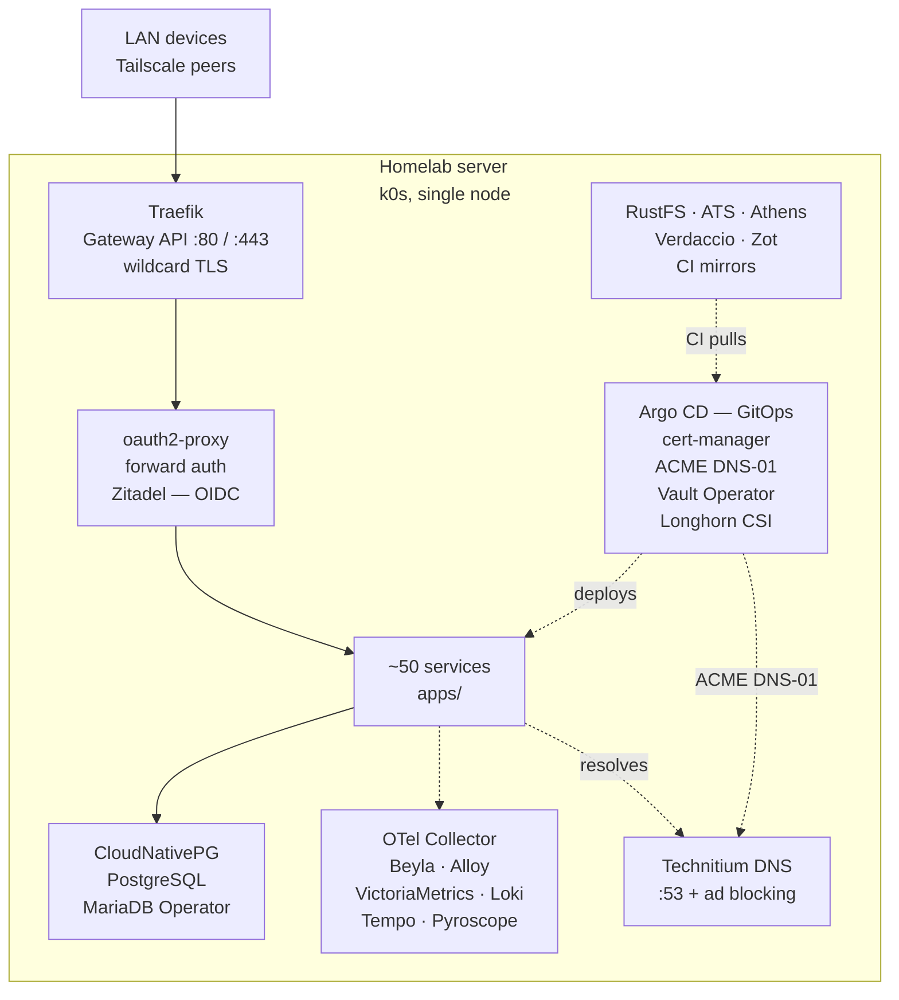

# Homelab

A home server run with production DevOps and SRE practices: **around fifty services in a Kubernetes cluster**.

This is not a demo stand but working infrastructure: it covers the daily needs of one household
while being engineered to the standards you would apply at work — digest-pinned images,
NetworkPolicies on the namespaces that run workloads, secrets that never touch Git, air-gapped CI,
blameless postmortems.

> Russian version: [`README.ru.md`](README.ru.md)

## What this demonstrates

| Area | What is here |
|---|---|
| **Kubernetes & GitOps** | k0s (embedded etcd, Calico vxlan), Longhorn CSI, CloudNativePG, MariaDB Operator, Traefik with Gateway API; Argo CD |
| **Supply chain & secrets** | Images pinned by `@sha256` digest, gitleaks on every push and PR, air-gapped runners with a checksum-verified toolchain; HashiCorp Vault and Vault Secrets Operator |
| **Observability & IaC** | All four signals — metrics, logs, traces, profiles — with cross-signal correlation; Terraform, one root module per external resource, Ansible with a `production` lint profile |
| **Testing & incidents** | CI gates; blameless postmortems with timelines, impact assessment, and tracked follow-ups |

## Architecture

One node: Ryzen 7 6800H, 8C/16T, Radeon 680M iGPU, 32 GiB RAM (≈27 GiB usable), 512 GB NVMe.

## Platform

| Component | Role | Directory |
|---|---|---|
| k0s | Single-node Kubernetes: Calico CNI, etcd, CoreDNS | [`platform/k0s/`](platform/k0s/) |
| Traefik | Gateway API | [`platform/traefik/`](platform/traefik/) |
| Technitium DNS | Local DNS, wildcard zone, ad blocking | [`apps/technitium/`](apps/technitium/) |
| cert-manager | TLS via ACME DNS-01 | [`platform/cert-manager/`](platform/cert-manager/) |
| Longhorn | CSI storage: snapshots, clones, RWX | [`platform/longhorn/`](platform/longhorn/) |
| CloudNativePG | PostgreSQL clusters | [`platform/cnpg/`](platform/cnpg/) |
| MariaDB Operator | MariaDB instances | [`platform/mariadb/`](platform/mariadb/) |
| Argo CD | GitOps controller | [`argocd/`](argocd/) |
| Vault Secrets Operator | Syncs Vault paths into Kubernetes Secrets | [`apps/vault/`](apps/vault/) |
| Ansible | Host packages and preparation | [`ansible/`](ansible/) |
| Terraform | Resources outside the cluster | [`terraform/`](terraform/) |

ACME DNS-01 is served by `cert-manager-webhook-dns01`, a webhook I wrote: neither DNS provider offers a working RFC2136. It ships as a Helm chart and releases both the image and the chart to an OCI registry on tag.

Zitadel is the primary OIDC provider. Services without native OIDC sit behind oauth2-proxy in forward-auth mode, so access control is enforced at the edge rather than per application.

## Supply chain

Every tool is fetched from an in-cluster mirror and verified against a pinned checksum.

- **RustFS** — S3-compatible artifact mirror
- **ATS** — Apache Traffic Server, HTTP caching proxy
- **Athens** — Go module proxy
- **Verdaccio** — npm registry
- **Zot** — OCI registry

## Observability

All four signals, collected and correlated so a single click moves between them.

| Signal | Stack | Notes |
|---|---|---|
| Metrics | VictoriaMetrics and vmagent | Dozens of scrape jobs, sub-minute interval, weeks of retention |
| Logs | Grafana Alloy to Loki | Secret redaction; level, trace_id, span_id as structured metadata |
| Traces | Tempo via OTLP | Traefik sampling plus Beyla eBPF, cluster-wide |
| Profiles | Pyroscope via Alloy eBPF | Includes off-CPU profiling |
| Errors | GlitchTip | Sentry SDK |
| Uptime | Gatus declarative, Uptime Kuma via Terraform | External DNS and upstream checks |

Retention is set by capacity, not aspiration: metrics keep about a month, logs, traces and profiles
about a week. Grafana wires the cross-signal links (`tracesToLogsV2`, `derivedFields`,
`tracesToProfiles`), alerting is Unified Alerting delivered to ntfy, and dashboards live in Git as
JSON with UI edits disabled.

Worth reading: [`docs/research/observability-standards-and-approaches.md`](docs/research/observability-standards-and-approaches.md)
and [`docs/research/observability-pitfalls.md`](docs/research/observability-pitfalls.md).

## CI

A set of Forgejo Actions workflows

| Check | Tool | Scope |
|---|---|---|
| `meta / commitlint` | commitlint | Conventional Commits, header length cap |
| `meta / actionlint` | actionlint | The workflows themselves |
| `meta / status` | status-badges.sh | Badge numbers match the repository |
| `security / gitleaks` | gitleaks | Secrets in commits and PR diffs |
| `lint / shellcheck` | shellcheck | All shell scripts |
| `lint / ansible-lint` | ansible-lint | `production` profile |
| `lint / tflint` | tflint | Terraform HCL, bundled ruleset |
| `manifests / kubeconform` | kubeconform | Manifests against Kubernetes and CR schemas |
| `manifests / kube-linter` | kube-linter | Security checks, explicit allow-list |

Local hooks run the same checks before a commit leaves the machine
([`.githooks/`](.githooks/)), so CI failures should be the exception rather than the routine.

## Services

### Infrastructure

| Service | Purpose |
|---|---|
| [Zitadel](apps/zitadel/) | Identity provider and SSO (primary) |
| [oauth2-proxy](apps/oauth2-proxy/) | Forward auth for services without their own login |
| [Technitium](apps/technitium/) | DNS server and ad blocking |
| [Homepage](apps/homepage/) | Start page |
| [Forgejo](apps/forgejo/) | Private Git forge and CI |
| [Vault](apps/vault/) | Secrets, transit, PKI |
| [Infisical](apps/infisical/) | Self-hosted secrets manager |
| [RustFS](apps/rustfs/) | S3-compatible object storage |
| [postgres](apps/postgres/) | pgweb admin UI |
| [WUD](apps/image-updates/) | Image update watcher, observe-only |
| [3x-ui](apps/3x-ui/) | Personal Xray proxy management |
| [code-server](apps/code-server/) | VS Code in the browser |
| [Headlamp](platform/headlamp/), [Radar](platform/radar/) | Cluster UIs |

### Applications

| Service | Purpose |
|---|---|
| [Immich](apps/immich/) | Photo and video library |
| [Jellyfin](apps/jellyfin/) | Home media server |
| [Navidrome](apps/navidrome/) | Music library |
| [Nextcloud](apps/nextcloud/) | Files, sync, calendar, contacts |
| [Seafile](apps/seafile/) | File sync and sharing, with OnlyOffice |
| [Jitsi](apps/jitsi/) | Private video conferencing |
| [Element](apps/element/) | Matrix chat and video calls via LiveKit — [custom Helm chart](apps/element/chart/) |
| [Talk HPB](apps/talk-hpb/) | Nextcloud Talk signaling |
| [Mailserver](apps/mailserver/) | Stalwart mail and Bulwark webmail |
| [Paperless](apps/paperless/), [PDF](apps/pdf/) | Documents, OCR, PDF operations |
| [Home Assistant](apps/home-assistant/) | Home automation |
| [Dawarich](apps/dawarich/) | Location history |
| [Lute](apps/lute/) | Language learning through reading |
| [Sure](apps/sure/) | Personal finances |
| [Open WebUI](apps/open-webui/), [LocalAI](apps/local-ai/) | LLM chat interface and CPU inference |
| [Mermaid](apps/mermaid-live-editor/) | Diagram editor |
| [Structurizr](apps/structurizr/) | Architecture diagrams |

## Known limitations

- **Single node.** No HA, no second scheduler, no real quorum. There are no PodDisruptionBudgets or
  topology spread constraints because they would be theatre. This is also why environments are not
  split by namespace — see [`docs/adr/0001-namespace-ownership.md`](docs/adr/0001-namespace-ownership.md).
- **No automated restore drill.** Longhorn snapshot classes exist and backup is documented, but no
  backup target is configured and no restore has been rehearsed.
- **No SLOs.** Alerting is symptom-based rather than driven by error budgets.
- **No policy admission controller.** The NetworkPolicies are hand-written; nothing prevents a
  future manifest from shipping without one.
- **Terraform state is local**, with no lock and no drift detection.
- **Images are digest-pinned but unsigned.** No SBOM, no signature verification, no CVE gate.
