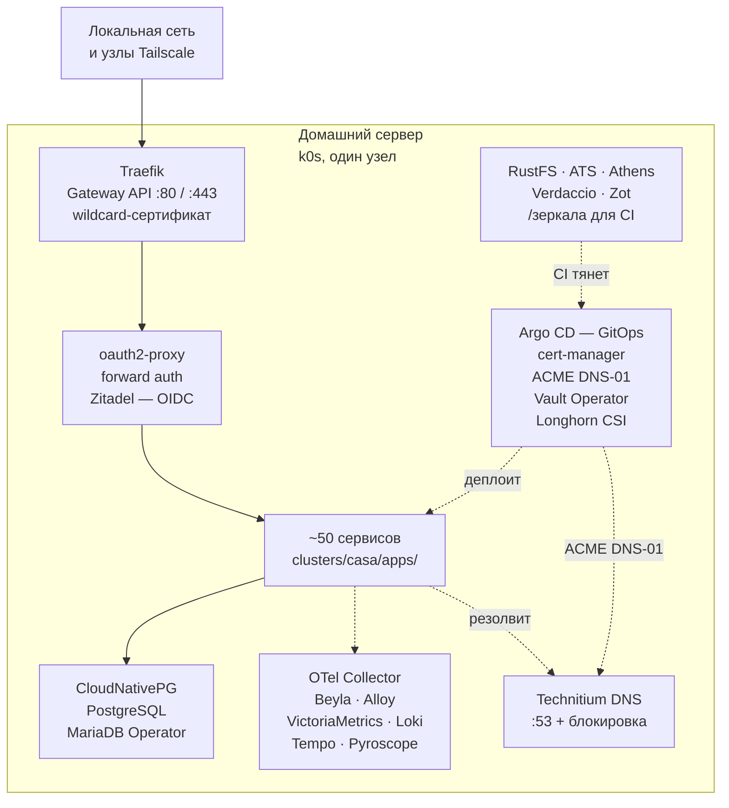

# Домашний сервер

Домашний сервер, работающий по production-практикам DevOps и SRE: **около пятидесяти сервисов в кластере Kubernetes**.

Здесь не демо-стенд, а работающая инфраструктура: она закрывает ежедневные потребности
домашнего хозяйства и при этом сделана по стандартам, которые применяют в работе, —
образы закреплены по digest, на namespace'ах с нагрузкой есть NetworkPolicy, секреты не
попадают в Git, CI работает без доступа в интернет, инциденты разбираются по blameless-постмортемам.

> English version: [`README.md`](README.md)

## Что здесь демонстрируется

| Область | Что здесь есть |
|---|---|
| **Kubernetes и GitOps** | k0s (встроенный etcd, Calico vxlan), Longhorn CSI, CloudNativePG, MariaDB Operator, Traefik с Gateway API; Argo CD |
| **Supply chain и секреты** | Образы закреплены по `@sha256`, gitleaks на каждом push и PR, раннеры без интернета с проверяемым по контрольным суммам тулчейном; HashiCorp Vault и Vault Secrets Operator |
| **Наблюдаемость и IaC** | Все четыре сигнала — метрики, логи, трейсы, профили — со связью друг с другом; Terraform, по одному root-модулю на внешний ресурс, Ansible с профилем линтера `production` |
| **Тестирование и инциденты** | Проверки в CI; blameless-постмортемы с таймлайном, оценкой влияния и отслеживаемыми действиями |

## Архитектура

Один узел: Ryzen 7 6800H, 8C/16T, iGPU Radeon 680M, 32 GiB (≈27 GiB доступно), 512 GB NVMe.

## Платформа

| Компонент | Роль | Каталог |
|---|---|---|
| k0s | Одноузловой Kubernetes: Calico CNI, etcd, CoreDNS | [`infra/host/k0s/`](infra/host/k0s/) |
| Traefik | Gateway API | [`clusters/casa/platform/traefik/`](clusters/casa/platform/traefik/) |
| Technitium DNS | Локальный DNS, wildcard-зона, блокировка рекламы | [`clusters/casa/apps/technitium/`](clusters/casa/apps/technitium/) |
| cert-manager | TLS через ACME DNS-01 | [`clusters/casa/platform/cert-manager/`](clusters/casa/platform/cert-manager/) |
| Longhorn | CSI-хранилище: снапшоты, клоны, RWX | [`clusters/casa/platform/longhorn/`](clusters/casa/platform/longhorn/) |
| CloudNativePG | Кластеры баз PostgreSQL | [`clusters/casa/platform/cnpg/`](clusters/casa/platform/cnpg/) |
| MariaDB Operator | Инстансы MariaDB | [`clusters/casa/platform/mariadb/`](clusters/casa/platform/mariadb/) |
| Argo CD | GitOps-контроллер | [`argocd/`](argocd/) |
| Vault Secrets Operator | Синхронизирует пути Vault в Kubernetes Secrets | [`clusters/casa/apps/vault/`](clusters/casa/apps/vault/) |
| Ansible | Пакеты и подготовка хоста | [`infra/ansible/`](infra/ansible/) |
| Terraform | Ресурсы вне кластера | [`infra/terraform/`](infra/terraform/) |

ACME DNS-01 обслуживает `cert-manager-webhook-dns01` — написанный мной вебхук: ни у одного DNS-провайдера нет рабочего RFC2136. Поставляется как Helm-чарт; по тегу публикует и образ, и чарт в OCI-реестр.

Zitadel — основной OIDC-провайдер. Сервисы без нативного OIDC стоят за oauth2-proxy в режиме forward auth, поэтому контроль доступа обеспечивается на периметре, а не в каждом приложении.

## Supply chain

Каждый инструмент скачивается из внутрикластерного зеркала и сверяется с закреплённой контрольной суммой.

- **RustFS** — S3-совместимое зеркало артефактов
- **ATS** — Apache Traffic Server, HTTP-кэширующий прокси
- **Athens** — Go-прокси модулей
- **Verdaccio** — npm-реестр
- **Zot** — OCI-реестр

## Наблюдаемость

Все четыре сигнала собраны и связаны между собой так, что один клик переходит от одного к
другому.

| Сигнал | Стек | Детали |
|---|---|---|
| Метрики | VictoriaMetrics и vmagent | Десятки scrape-задач, интервал меньше минуты, несколько недель хранения |
| Логи | Grafana Alloy → Loki | Редакция секретов; level, trace_id, span_id как структурированные метаданные |
| Трейсы | Tempo через OTLP | Сэмплинг Traefik и eBPF Beyla по всему кластеру |
| Профили | Pyroscope через Alloy eBPF | Включая off-CPU профилирование |
| Ошибки | GlitchTip | Sentry SDK |
| Доступность | Gatus декларативно, Uptime Kuma через Terraform | Проверки внешнего DNS и апстримов |

Сроки хранения заданы ёмкостью, а не желанием: метрики примерно месяц, логи, трейсы и профили около недели. Grafana связывает сигналы (`tracesToLogsV2`, `derivedFields`, `tracesToProfiles`), алертинг — Grafana Unified Alerting с доставкой в ntfy, дашборды лежат в Git как JSON с отключённым редактированием в UI.

Стоит прочитать: [`docs/research/observability-standards-and-approaches.md`](docs/research/observability-standards-and-approaches.md)
и [`docs/research/observability-pitfalls.md`](docs/research/observability-pitfalls.md).

## CI

Набор workflow на Forgejo Actions.

| Проверка | Инструмент | Что проверяет |
|---|---|---|
| `meta / commitlint` | commitlint | Conventional Commits, ограничение длины заголовка |
| `meta / actionlint` | actionlint | Сами workflow |
| `meta / status` | status-badges.sh | Числа бейджей соответствуют репозиторию |
| `security / gitleaks` | gitleaks | Секреты в коммитах и диффах PR |
| `lint / shellcheck` | shellcheck | Все shell-скрипты |
| `lint / ansible-lint` | ansible-lint | Профиль `production` |
| `lint / tflint` | tflint | HCL Terraform, встроенный ruleset |
| `manifests / kubeconform` | kubeconform | Манифесты по схемам Kubernetes и CR |
| `manifests / kube-linter` | kube-linter | Проверки безопасности, явный allow-list |

Локальные хуки прогоняют те же проверки до того, как коммит покинет машину
([`.githooks/`](.githooks/)), так что падения в CI — исключение, а не норма.

## Сервисы

### Инфраструктура

| Сервис | Назначение |
|---|---|
| [Zitadel](clusters/casa/apps/zitadel/) | Identity provider и SSO (основной) |
| [oauth2-proxy](clusters/casa/apps/oauth2-proxy/) | Forward auth для сервисов без своего входа |
| [Technitium](clusters/casa/apps/technitium/) | DNS-сервер и блокировка рекламы |
| [Homepage](clusters/casa/apps/homepage/) | Стартовая страница |
| [Forgejo](clusters/casa/apps/forgejo/) | Приватный Git-сервис и CI |
| [Vault](clusters/casa/apps/vault/) | Секреты, transit, PKI |
| [Infisical](clusters/casa/apps/infisical/) | Self-hosted secrets manager |
| [RustFS](clusters/casa/apps/rustfs/) | S3-совместимое объектное хранилище |
| [postgres](clusters/casa/apps/postgres/) | Веб-админка PostgreSQL (pgweb) |
| [WUD](clusters/casa/apps/image-updates/) | Наблюдение за обновлениями образов |
| [3x-ui](clusters/casa/apps/3x-ui/) | Управление личным Xray-прокси |
| [code-server](clusters/casa/apps/code-server/) | VS Code в браузере |
| [Headlamp](clusters/casa/platform/headlamp/), [Radar](clusters/casa/platform/radar/) | UI кластера |

### Приложения

| Сервис | Назначение |
|---|---|
| [Immich](clusters/casa/apps/immich/) | Фото- и видеотека |
| [Jellyfin](clusters/casa/apps/jellyfin/) | Домашний медиасервер |
| [Navidrome](clusters/casa/apps/navidrome/) | Музыкальная библиотека |
| [Nextcloud](clusters/casa/apps/nextcloud/) | Файлы, синхронизация, календарь, контакты |
| [Seafile](clusters/casa/apps/seafile/) | Файловая синхронизация и обмен файлами, с OnlyOffice |
| [Jitsi](clusters/casa/apps/jitsi/) | Приватные видеоконференции |
| [Element](clusters/casa/apps/element/) | Matrix-чат и видеозвонки через LiveKit — [собственный Helm-чарт](clusters/casa/apps/element/chart/) |
| [Talk HPB](clusters/casa/apps/talk-hpb/) | Signaling для Nextcloud Talk |
| [Mailserver](clusters/casa/apps/mailserver/) | Почта Stalwart и веб-почта Bulwark |
| [Paperless](clusters/casa/apps/paperless/), [PDF](clusters/casa/apps/pdf/) | Документы, OCR, операции с PDF |
| [Home Assistant](clusters/casa/apps/home-assistant/) | Автоматизация дома |
| [Dawarich](clusters/casa/apps/dawarich/) | История местоположений |
| [Lute](clusters/casa/apps/lute/) | Изучение языков через чтение |
| [Sure](clusters/casa/apps/sure/) | Личные финансы |
| [Open WebUI](clusters/casa/apps/open-webui/), [LocalAI](clusters/casa/apps/local-ai/) | Чат-интерфейс для LLM и CPU-инференс |
| [Mermaid](clusters/casa/apps/mermaid-live-editor/) | Редактор диаграмм |
| [Structurizr](clusters/casa/apps/structurizr/) | Архитектурные диаграммы |

## Известные ограничения

- **Один узел.** Ни HA, ни второго планировщика, ни настоящего кворума. PodDisruptionBudget и
  topology spread constraints не используются, потому что на одном узле они были бы
  театром. По этой же причине среды не разводятся namespace'ами — см.
  [`docs/adr/0001-namespace-ownership.md`](docs/adr/0001-namespace-ownership.md).
- **Нет автоматической проверки восстановления.** VolumeSnapshotClasses у Longhorn есть, бэкап
  описан, но backup target не настроен и восстановление ни разу не репетировали.
- **Нет SLO.** Алертинг симптомный, а не построенный на error budgets.
- **Нет admission-контроллера политик.** NetworkPolicy написаны руками, и ничто не мешает
  выпустить манифест без него.
- **State Terraform локальный** — без лока и без обнаружения дрейфа.
- **Образы закреплены по digest, но не подписаны.** Ни SBOM, ни проверки подписи, ни фильтра по CVE.
