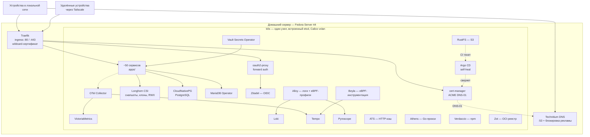

# Домашний сервер

Домашний сервер, работающий по production-практикам: **около пятидесяти сервисов на
одноузловом кластере Kubernetes**, всё описано кодом и эксплуатируется как учебный
проект по DevOps и SRE.

Здесь не демо-стенд, а работающая инфраструктура: она закрывает ежедневные потребности
домашнего хозяйства и при этом сделана по стандартам, которые применяют в работе, —
образы закреплены по digest, на namespace'ах с нагрузкой есть NetworkPolicy, секреты не
попадают в Git, CI работает без доступа в интернет, инциденты разбираются по
blameless-постмортемам, а ADR объясняют, почему каждое решение сложилось именно так.

> English version: [`README.md`](README.md)

## Состояние

[](docs/status/README.md)
[](docs/status/README.md)
[](docs/status/README.md)
[](docs/status/README.md)
[](docs/adr/)
[](docs/incidents/)

Это не бейджи аптайма. Каждое число считается из самого репозитория скриптом
[`scripts/status-badges.sh`](scripts/status-badges.sh), и CI падает, если значения в
коммите разошлись с кодом, поэтому любое из них можно пересчитать и поспорить с ним: что
считается и что намеренно не считается, написано в
[`docs/status/`](docs/status/README.md). Доступности, SLO и MTTR здесь пока нет — им нужна
история, которая лежит в Gatus, а не в Git.

## Что здесь демонстрируется

Не список инструментов, а набор практик, которые я могу объяснить и защитить:

| Область | Что здесь есть |
|---|---|
| **Kubernetes** | Одноузловой k0s (встроенный etcd, Calico vxlan), Longhorn CSI, CloudNativePG, MariaDB Operator, Traefik, несколько десятков NetworkPolicy |
| **GitOps** | Argo CD с selfHeal, сверка Git и кластера, правила prune, выбранные отдельно для каждого компонента |
| **Supply chain** | Практически все образы закреплены по `@sha256`, gitleaks на каждом push и PR, раннеры без интернета с проверяемым по контрольным суммам тулчейном |
| **Секреты** | HashiCorp Vault и Vault Secrets Operator как основной путь, несколько десятков `VaultStaticSecret`, SOPS и SealedSecrets как легаси |
| **Наблюдаемость** | Все четыре сигнала: метрики, логи, трейсы, профили, с связанными друг с другом дашбордами |
| **IaC** | Terraform, по одному root-модулю на внешний ресурс, и Ansible с профилем линтера `production` |
| **Тестирование** | Набор проверок в CI, golden-file тесты для форматирования манифестов, юнит-тесты на Go |
| **Инциденты** | Blameless-постмортемы с таймлайном, оценкой влияния и отслеживаемыми действиями |

## Архитектура



Источник модели архитектуры: [`apps/structurizr/homelab.dsl`](apps/structurizr/homelab.dsl) —
рабочее пространство Structurizr DSL, которое рендерится развёрнутым экземпляром Structurizr.

## Платформа

| Компонент | Роль | Каталог |
|---|---|---|
| k0s | Одноузловой Kubernetes: Calico CNI, встроенный etcd, CoreDNS | [`platform/k0s/`](platform/k0s/) |
| Gateway + Traefik | Gateway API на :80/:443 через `externalIPs`, wildcard-сертификат | [`platform/traefik/`](platform/traefik/) |
| Technitium DNS | Локальный DNS, wildcard-зона, блокировка рекламы | [`apps/technitium/`](apps/technitium/) |
| cert-manager | TLS через ACME DNS-01 | [`platform/cert-manager/`](platform/cert-manager/) |
| Longhorn | CSI-хранилище: снапшоты, клоны, RWX | [`platform/longhorn/`](platform/longhorn/) |
| CloudNativePG | Кластеры баз PostgreSQL | [`platform/cnpg/`](platform/cnpg/) |
| MariaDB Operator | Инстансы MariaDB, где CNPG не подходит | [`platform/mariadb/`](platform/mariadb/) |
| Argo CD | GitOps-контроллер, намеренно пробный стенд | [`argocd/`](argocd/) |
| Vault Secrets Operator | Синхронизирует пути Vault в Kubernetes Secrets | [`apps/vault/`](apps/vault/) |
| Ansible | Пакеты и подготовка хоста | [`ansible/`](ansible/) |
| Terraform | Ресурсы вне кластера | [`terraform/`](terraform/) |

ACME DNS-01 обслуживает написанный мной вебхук: DNS-провайдер резервирует имя
`_acme-challenge.` и сломан RFC2136-delete — см. `cert-manager-webhook-dns01` ниже.

## Supply chain

У раннеров CI нет прямого доступа в интернет. Каждый инструмент скачивается из
внутрикластерного зеркала и сверяется с закреплённой контрольной суммой в
[`apps/rustfs/artifacts.tsv`](apps/rustfs/artifacts.tsv):

- **RustFS** — S3-совместимое зеркало артефактов
- **ATS** — Apache Traffic Server, HTTP-кэширующий прокси
- **Athens** — Go-прокси модулей
- **Verdaccio** — npm-реестр
- **Zot** — OCI-реестр

Зеркала пополняет CronJob `mirror-sync`. Так тулчейн превращается из неявной зависимости от
публичного интернета в проверяемый, с контрольными суммами и воспроизводимый — именно это и
делает доверенным раннер без доступа в сеть.

## Секреты

Расшифрованный секрет существует только в Vault. Манифесты описывают, что нужно, оператор
материализует.

- Несколько десятков объектов `VaultStaticSecret` и `VaultAuth` по сервисам
- Политики и роли описываются в Terraform, а не в YAML: [`terraform/vault/`](terraform/vault/)
- Раскладка путей и обоснование: [`docs/adr/0006-vault-secret-path-layout.md`](docs/adr/0006-vault-secret-path-layout.md)
- SOPS и SealedSecrets остались только там, где миграция ещё не закончена
- gitleaks блокирует секреты и на локальных коммитах, и в CI

## Наблюдаемость

Все четыре сигнала собраны и связаны между собой так, что один клик переходит от одного к
другому.

| Сигнал | Стек | Детали |
|---|---|---|
| Метрики | VictoriaMetrics и vmagent | Десятки scrape-задач, интервал меньше минуты, несколько недель хранения |
| Логи | Grafana Alloy → Loki | Редакция секретов; level, trace_id, span_id как структурированные метаданные |
| Трейсы | Tempo через OTLP | Сэмплинг Traefik и eBPF Beyla по всему кластеру |
| Профили | Pyroscope через Alloy eBPF | Включая off-CPU профилирование |
| Ошибки | GlitchTip | Sentry SDK |
| Доступность | Gatus декларативно, Uptime Kuma через Terraform | Проверки внешнего DNS и апстримов |

Сроки хранения заданы ёмкостью, а не желанием: метрики примерно месяц, логи, трейсы и
профили около недели, и числа пересматриваются каждый раз, когда заканчивается диск.

Grafana связывает сигналы между собой: `tracesToLogsV2` в Loki, `derivedFields` Loki обратно
в Tempo, `tracesToProfiles` в Pyroscope. Алертинг — Grafana Unified Alerting, покрывает и
метрики, и логи, доставка в ntfy. Дашборды лежат в Git как JSON с отключённым редактированием
в UI, поэтому на экране ровно то, что развёрнуто.

Стоит прочитать: [`docs/research/observability-standards-and-approaches.md`](docs/research/observability-standards-and-approaches.md)
и [`docs/research/observability-pitfalls.md`](docs/research/observability-pitfalls.md).

## Идентификация

Zitadel — основной OIDC-провайдер. Сервисы без нативного OIDC стоят за oauth2-proxy в режиме forward auth, поэтому контроль доступа обеспечивается на ingress, а не в каждом приложении.

## CI

Набор workflow на Forgejo Actions.

| Проверка | Инструмент | Что проверяет |
|---|---|---|
| `meta / commitlint` | commitlint | Conventional Commits, ограничение длины заголовка |
| `meta / actionlint` | actionlint | Сами workflow |
| `meta / status` | status-badges.sh | Числа бейджей соответствуют репозиторию |
| `security / gitleaks` | gitleaks | Секреты в коммитах и диффах PR |
| `lint / shellcheck` | shellcheck | Все shell-скрипты |
| `lint / ansible-lint` | ansible-lint | Профиль `production` |
| `lint / tflint` | tflint | HCL Terraform, встроенный ruleset |
| `manifests / kubeconform` | kubeconform | Манифесты по настоящим схемам Kubernetes |
| `manifests / kube-linter` | kube-linter | Проверки безопасности, явный allow-list |

Каждый инструмент скачивается из внутрикластерного зеркала и сверяется с закреплённой
контрольной суммой, потому что у раннеров нет доступа в интернет. Подробности в разделе
[Supply chain](#supply-chain).

Локальные хуки прогоняют те же проверки до того, как коммит покинет машину
([`.githooks/`](.githooks/)), так что падения в CI — исключение, а не норма.

## Свои инструменты

Написаны под конкретную задачу здесь, а не для заполнения пробела.

**`kubiform`** — форматтер порядка полей в манифестах в духе
gofmt, с режимом `-check`. Применённый YAML остаётся стабильным, поэтому в диффе видны
настоящие изменения, а не перестановка полей. Внутри — словари для используемых здесь CRD и
большой набор golden-файлов.

**`cert-manager-webhook-dns01`** — солвер ACME
DNS-01 для провайдера, который резервирует имя challenge. Поставляется как Helm-чарт; по тегу
публикует и образ, и чарт в OCI-реестр.

Оба лежат в `packages/`, который здесь в gitignore, — это самостоятельные репозитории со своими
ремоутами, трекерами задач и CI.

## Сервисы

### Инфраструктура

| Сервис | Назначение |
|---|---|
| [Zitadel](apps/zitadel/) | Identity provider и SSO (основной) |
| [Authentik](apps/authentik/) | Identity provider и SSO (тестовый стенд) |
| [oauth2-proxy](apps/oauth2-proxy/) | Forward auth для сервисов без своего входа |
| [Technitium](apps/technitium/) | DNS-сервер и блокировка рекламы |
| [Homepage](apps/homepage/) | Стартовая страница |
| [Forgejo](apps/forgejo/) | Приватный Git-сервис и CI |
| [Vault](apps/vault/) | Секреты, transit, PKI |
| [Infisical](apps/infisical/) | Self-hosted secrets manager |
| [RustFS](apps/rustfs/) | S3-совместимое объектное хранилище |
| [postgres](apps/postgres/) | Веб-админка PostgreSQL (pgweb) |
| [WUD](apps/image-updates/) | Наблюдение за обновлениями образов |
| [3x-ui](apps/3x-ui/) | Управление личным Xray-прокси |
| [code-server](apps/code-server/) | VS Code в браузере |
| [Headlamp](platform/headlamp/), [Radar](platform/radar/) | UI кластера |

### Приложения

| Сервис | Назначение |
|---|---|
| [Immich](apps/immich/) | Фото- и видеотека |
| [Jellyfin](apps/jellyfin/) | Домашний медиасервер |
| [Navidrome](apps/navidrome/) | Музыкальная библиотека |
| [Nextcloud](apps/nextcloud/) | Файлы, синхронизация, календарь, контакты |
| [Seafile](apps/seafile/) | Файловая синхронизация и обмен файлами, с OnlyOffice |
| [Jitsi](apps/jitsi/) | Приватные видеоконференции |
| [Element](apps/element/) | Matrix-чат и видеозвонки через LiveKit — [собственный Helm-чарт](apps/element/chart/) |
| [Talk HPB](apps/talk-hpb/) | Signaling для Nextcloud Talk |
| [Mailserver](apps/mailserver/) | Почта Stalwart и веб-почта Bulwark |
| [Paperless](apps/paperless/), [PDF](apps/pdf/) | Документы, OCR, операции с PDF |
| [Home Assistant](apps/home-assistant/) | Автоматизация дома |
| [Dawarich](apps/dawarich/) | История местоположений |
| [Lute](apps/lute/) | Изучение языков через чтение |
| [Sure](apps/sure/) | Личные финансы |
| [Open WebUI](apps/open-webui/), [LocalAI](apps/local-ai/) | Чат-интерфейс для LLM и CPU-инференс |
| [Mermaid](apps/mermaid-live-editor/) | Редактор диаграмм |
| [Structurizr](apps/structurizr/) | Архитектурные диаграммы |

### Наблюдаемость

[VictoriaMetrics](apps/victoria-metrics/) · [Grafana](apps/grafana/) · [Tempo](apps/tempo/) ·
[Loki](apps/loki/) и [Alloy](apps/alloy/) · [Pyroscope](apps/pyroscope/) и
[alloy-profiler](apps/alloy-profiler/) · [Beyla](apps/beyla/) · [OTel Collector](apps/otel-collector/) ·
[Netdata](apps/netdata/) · [Gatus](apps/gatus/) · [Uptime Kuma](apps/uptime-kuma/) ·
[GlitchTip](apps/glitchtip/) · [Beszel](apps/beszel/) · [node-exporter](apps/node-exporter/) ·
[db-exporters](apps/db-exporters/)

Выведен из эксплуатации: [elk](apps/elk/) — заменён на Loki и Alloy, когда стало ясно, что
второй бэкенд логов избыточен.

## Структура репозитория

```
apps/<сервис>/k8s/      манифесты, по каталогу на сервис
apps/<сервис>/README.md  раннбук: развернуть, проверить, эксплуатировать
platform/                k0s, traefik, longhorn, cnpg, mariadb, cert-manager
platform/homelab/        Helm-чарт со всеми HTTP-маршрутами и общей конфигурацией
argocd/                  values Argo CD, по одному Application на компонент
ansible/                 роли и плейбуки для хоста
terraform/<модуль>/      по одному root-модулю на внешний ресурс
packages/                самостоятельные Go-проекты, у каждого свой репозиторий и ремоут
docs/                    ADR, исследования, инциденты, разборы, документы для агентов
```

Почему слои такие: [`docs/adr/0004-repository-layout.md`](docs/adr/0004-repository-layout.md).
Настоящий домен и адрес сервера лежат в `platform/homelab/values.yaml`, credentials — в Vault
([`docs/adr/0009`](docs/adr/0009-internal-values-in-repo.md)).

## Доставка изменений

Каждое изменение проходит через issue, PR и squash-merge, затем проверяется на реальном
кластере, и только после этого issue закрывается.

1. Изменить манифесты локально, закоммитить, открыть PR со ссылкой на issue.
2. На сервере забрать изменения и применить только затронутое:
   - `kubectl apply -f apps/<сервис>/k8s/`
   - `helm template platform/homelab | kubectl apply -f -`
3. Проверить health, DNS и HTTP-маршрут. Только потом закрыть issue.

`helm template … | kubectl apply -f -` ничего не удаляет: объект, убранный из чарта,
остаётся в кластере, продолжает обслуживать трафик и выглядит как успешное изменение.
`helm template … | kubectl delete -f -` хуже — сносит все объекты, которые рендерит чарт,
включая те, к которым изменение отношения не имеет. Удалять поимённо
(`kubectl delete httproute -n <ns> <name> -n <ns> <name>`) и проверять `kubectl get`,
что старый объект исчез.

GitOps проверяется через Argo CD с `selfHeal: true`, который уже ловил и откатывал дрейф.
Prune намеренно отключён там, где задействованы CRD или StatefulSet: неверный prune на
одноузловом кластере — это не уборка, а авария. Отклонения от дефолтов чарта записаны с
обоснованием в [`argocd/install/values.yaml`](argocd/install/values.yaml).

## Инженерная практика

- **ADR** — записи решений с контекстом и последствиями: [`docs/adr/`](docs/adr/)
- **Постмортемы** — blameless-разборы с таймлайном и влиянием: [`docs/incidents/`](docs/incidents/)
- **Исследования** — десятки заметок о выборе инструментов, написанных до внедрения, а не
  после: [`docs/research/`](docs/research/)
- **Диагностика** — разборы отдельно от инцидентов, потому что не всякая проблема инцидент:
  [`docs/troubleshot/`](docs/troubleshot/)
- **Язык домена** — письменный словарь, чтобы термины не разъезжались между задачами:
  [`CONTEXT.md`](CONTEXT.md)

## Известные ограничения

Прямо и честно: знать границы системы — часть её эксплуатации.

- **Один узел.** Ни HA, ни второго планировщика, ни настоящего кворума. PodDisruptionBudget и
  topology spread constraints не используются, потому что на одном узле они были бы
  театром. По этой же причине среды не разводятся namespace'ами — см.
  [`docs/adr/0001-namespace-ownership.md`](docs/adr/0001-namespace-ownership.md).
- **Нет автоматической проверки восстановления.** VolumeSnapshotClasses у Longhorn есть, бэкап
  описан, но backup target не настроен и восстановление ни разу не репетировали.
- **Нет SLO.** Алертинг симптомный, а не построенный на error budgets.
- **Нет admission-контроллера политик.** NetworkPolicy написаны руками, и ничто не мешает
  выпустить манифест без него.
- **State Terraform локальный** — по замыслу, без лока и без обнаружения дрейфа. CI для
  Terraform тоже пока нет.
- **Образы закреплены по digest, но не подписаны.** Ни SBOM, ни проверки подписи, ни фильтра по
  CVE.
- **CI ничего не разворачивает.** Все проверки статические: манифесты нигде не применяются на
  эфемерный кластер, чтобы доказать, что они работают.
- **WUD только наблюдает** — триггеры обновлений не настроены.
